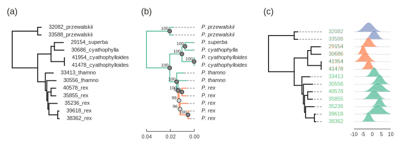

Toytree
==========

Tree plotting with **Toytree** in Python
----------------------------------------
Welcome to toytree, a Python library for tree object data parsing, visualization,
manipulation, and numerical and evolutionary analyses. If you are new to toytree, head to 
the [User Guide](https://eaton-lab.org/toytree/quick_guide/) to see examples and learn about its features.

The goal of toytree is to provide a light-weight Python equivalent to widely used tree analysis
and plotting libraries in R, and in doing so, to promote further development of phylogenetic and
evolutionary analysis methods in Python.

Toytree generates rich interactive figures (SVG+HTML+JS) that render in jupyter-notebooks or webpages,
and can be exported as high quality SVG, PDF, or PNG figures for publications. The library is minimal
dependencies, is easy to install, and can be easily incorporated into other projects. 


Current release info
--------------------
| Name | Downloads | Version | Platforms |
| --- | --- | --- | --- |
| [](https://anaconda.org/conda-forge/toytree) | [](https://anaconda.org/conda-forge/toytree) | [](https://anaconda.org/conda-forge/toytree) | [](https://anaconda.org/conda-forge/toytree) |

Installing toytree
-------------------
Toytree can be installed using conda or pip (conda preferred):
```
conda install toytree -c conda-forge
```
It is possible to list all of the versions of `toytree` available on your platform with:
```
conda search toytree --channel conda-forge
```

Documentation
-------------
See the full documentation at [http://eaton-lab.org/toytree](http://eaton-lab.org/toytree).


Example code
------------

```python
# import toyplot and load a newick file from a public URL
import toytree
tre = toytree.tree("https://eaton-lab.org/data/Cyathophora.tre")

# root the tree using a wildcard string matching and draw a tree figure.
rtre = tre.root('~prz')
rtre.draw(width=400, tip_labels_align=True);

# or chain a few functions together
tre.root('~prz').drop_tips("~tham").ladderize().draw();

# extensive styling options are available
rtre.draw(
    tip_labels_colors='pink',
    node_labels='support',
    node_sizes=15,
    node_colors="cyan",
    edge_style={
        "stroke": "darkgrey", 
        "stroke-width": 3,
    },
)
```

Example plots
------------


